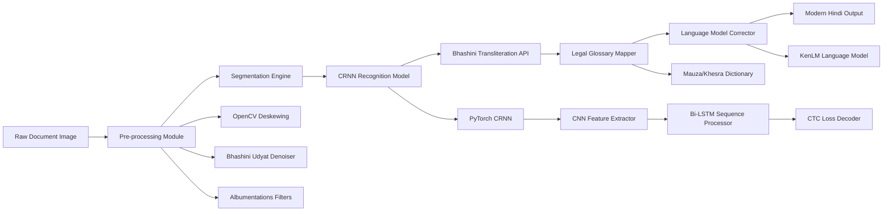

# Design Document: Kaithi-Drishyam OCR System

## Overview

Kaithi-Drishyam is an end-to-end AI-powered system that transforms historical Kaithi script land records into modern Hindi text. The system addresses the critical challenge of digitizing 100-year-old handwritten cursive documents that are deteriorating in government archives across Bihar and UP. 

The solution implements a three-phase pipeline: (1) Pre-processing & Segmentation, (2) CRNN-based Recognition Engine, and (3) Transliteration & Modernization with Bhashini integration. This design ensures the system can handle the unique challenges of historical document digitization while meeting Bhashini quality benchmarks.

## Architecture

The system follows a modular microservices architecture with clear separation between image processing, AI inference, and language services. The architecture is designed for scalability and integration with existing government systems.



### Core Components

1. **Document Processor**: Handles image preprocessing using OpenCV and Bhashini Udyat APIs
2. **Segmentation Engine**: Identifies and isolates text lines from complex document layouts
3. **CRNN Recognition Model**: Deep learning model specifically trained for handwritten Kaithi cursive
4. **Transliteration Service**: Converts Kaithi to Devanagari with legal terminology mapping
5. **Language Corrector**: KenLM-based post-processing for contextual error correction
6. **Web Interface**: User-friendly portal for government officials
7. **REST API**: Programmatic access for system integration

## Components and Interfaces

### Phase 1: Pre-Processing & Segmentation Pipeline

**Document Processor Interface**
```python
class DocumentProcessor:
    def preprocess_image(self, image: np.ndarray) -> ProcessedImage:
        """Apply deskewing, binarization, and noise reduction"""
        
    def integrate_udyat_denoiser(self, image: np.ndarray) -> np.ndarray:
        """Call Bhashini Udyat API for noise reduction"""
        
    def apply_custom_filters(self, image: np.ndarray) -> np.ndarray:
        """Apply document-specific artifact removal using Albumentations"""
```

**Segmentation Engine Interface**
```python
class SegmentationEngine:
    def detect_text_lines(self, image: ProcessedImage) -> List[TextLine]:
        """Identify individual text lines with bounding boxes"""
        
    def maintain_reading_order(self, lines: List[TextLine]) -> List[TextLine]:
        """Sort lines from top to bottom, handle multi-column layouts"""
```

### Phase 2: Core Recognition Engine (CRNN + CTC)

**CRNN Architecture**
```python
class KaithiCRNN(nn.Module):
    def __init__(self):
        self.cnn_backbone = CNNFeatureExtractor()  # ResNet-based
        self.rnn_processor = nn.LSTM(hidden_size=256, bidirectional=True)
        self.ctc_decoder = CTCDecoder()
        
    def forward(self, image_batch: torch.Tensor) -> torch.Tensor:
        """Process handwritten Kaithi text sequences"""
```

**Synthetic Data Generator**
```python
class SyntheticDataGenerator:
    def generate_kaithi_images(self, hindi_text: str) -> np.ndarray:
        """Render Hindi text using authentic Kaithi TTF fonts"""
        
    def apply_aging_effects(self, image: np.ndarray) -> np.ndarray:
        """Add ink-bleed, fading, smudges, and paper deterioration"""
        
    def create_training_dataset(self, size: int = 10000) -> Dataset:
        """Generate comprehensive synthetic training data"""
```

### Phase 3: Transliteration & Modernization

**Transliteration Service Interface**
```python
class TransliterationService:
    def kaithi_to_devanagari(self, kaithi_text: str) -> str:
        """Convert Kaithi characters to Devanagari equivalents"""
        
    def apply_legal_glossary(self, text: str) -> str:
        """Map historical legal terms (Mauza, Khesra) to modern equivalents"""
```

**Language Model Corrector**
```python
class LanguageModelCorrector:
    def __init__(self):
        self.kenlm_model = kenlm.Model('hindi_legal.arpa')
        
    def correct_ocr_errors(self, text: str) -> str:
        """Apply contextual correction using KenLM probabilities"""
```

## Data Models

### Core Data Structures

```python
@dataclass
class ProcessedImage:
    image: np.ndarray
    deskew_angle: float
    noise_level: float
    preprocessing_metadata: Dict[str, Any]

@dataclass
class TextLine:
    bounding_box: Tuple[int, int, int, int]
    cropped_image: np.ndarray
    reading_order: int
    confidence_score: float

@dataclass
class RecognitionResult:
    kaithi_text: str
    confidence_scores: List[float]
    character_positions: List[Tuple[int, int]]
    low_confidence_regions: List[Tuple[int, int]]

@dataclass
class TransliterationResult:
    devanagari_text: str
    modern_hindi_text: str
    legal_term_mappings: Dict[str, str]
    language_model_corrections: List[str]

@dataclass
class DocumentResult:
    original_image_path: str
    processed_lines: List[TextLine]
    recognition_results: List[RecognitionResult]
    final_text: str
    processing_time: float
    accuracy_metrics: Dict[str, float]
```

### Database Schema

```sql
-- Documents table
CREATE TABLE documents (
    id UUID PRIMARY KEY,
    original_filename VARCHAR(255),
    upload_timestamp TIMESTAMP,
    processing_status VARCHAR(50),
    user_id VARCHAR(100)
);

-- Recognition results table
CREATE TABLE recognition_results (
    id UUID PRIMARY KEY,
    document_id UUID REFERENCES documents(id),
    line_number INTEGER,
    kaithi_text TEXT,
    devanagari_text TEXT,
    modern_hindi_text TEXT,
    confidence_score FLOAT,
    manual_corrections TEXT
);

-- Legal glossary table
CREATE TABLE legal_glossary (
    historical_term VARCHAR(100) PRIMARY KEY,
    modern_equivalent VARCHAR(100),
    context VARCHAR(200),
    usage_frequency INTEGER
);
```

## Correctness Properties

*A property is a characteristic or behavior that should hold true across all valid executions of a system—essentially, a formal statement about what the system should do. Properties serve as the bridge between human-readable specifications and machine-verifiable correctness guarantees.*

Now I need to analyze the acceptance criteria to determine which ones can be tested as properties:

<function_calls>
<invoke name="prework">
<parameter name="featureName">kaithi-ocr

Based on the prework analysis, I can now identify the key properties that need to be tested. After reviewing all the testable criteria, I can consolidate them into comprehensive properties that eliminate redundancy:

**Property Reflection:**
- Many image processing properties (1.1-1.6) can be combined into comprehensive preprocessing validation
- Segmentation properties (2.1-2.5) can be consolidated into segmentation correctness validation  
- Recognition properties (3.1-3.5) focus on CRNN output validation and confidence scoring
- Transliteration properties (4.1-4.5) can be combined into transliteration accuracy validation
- Performance and API properties can be grouped by functional area

### Property 1: Image Format and Preprocessing Pipeline
*For any* uploaded image in JPEG, PNG, or TIFF format, the Document_Processor should successfully preprocess it by applying deskewing (for angles up to 15 degrees), binarization, noise reduction, and border removal, producing a ProcessedImage with valid metadata.
**Validates: Requirements 1.1, 1.3, 1.4, 1.5, 1.6**

### Property 2: Bhashini Integration Robustness  
*For any* image processing request, when Bhashini Udyat Denoiser API is available, the system should integrate successfully with proper authentication and error recovery, and when unavailable, should gracefully fallback to custom Albumentations filters.
**Validates: Requirements 1.2, 8.5**

### Property 3: Text Segmentation Correctness
*For any* document image, the Segmentation_Module should identify all text lines with valid bounding boxes, maintain top-to-bottom reading order, exclude non-text elements, and output both coordinates and cropped images for each detected line.
**Validates: Requirements 2.1, 2.2, 2.3, 2.4, 2.5**

### Property 4: CRNN Recognition Output Validation
*For any* text line image, the Recognition_Model should use CRNN+CTC architecture to output Kaithi character sequences with confidence scores, handle handwritten cursive variations, and flag low-confidence regions for manual review.
**Validates: Requirements 3.1, 3.2, 3.3, 3.4, 3.5**

### Property 5: Transliteration and Legal Term Mapping
*For any* recognized Kaithi text, the Transliteration_Service should convert characters to Devanagari equivalents, map legal terms (Mauza, Khesra, Zamin) using the Legal_Glossary, apply KenLM-based error correction, and preserve document structure.
**Validates: Requirements 4.1, 4.2, 4.3, 4.4, 4.5**

### Property 6: Proper Noun and Alternative Interpretation Handling
*For any* text containing proper nouns or ambiguous terms, the Translation_API should preserve names and locations unchanged while providing alternative interpretations for ambiguous cases.
**Validates: Requirements 5.1, 5.3, 5.4**

### Property 7: Synthetic Data Generation Pipeline
*For any* Hindi text input, the synthetic data generator should render it using authentic Kaithi fonts, apply realistic aging effects (ink-bleed, fading, deterioration), add document artifacts using Albumentations, and maintain proper dataset splits.
**Validates: Requirements 6.1, 6.2, 6.3, 6.4, 6.5**

### Property 8: API Response Format and Error Handling
*For any* REST API request, the system should return properly formatted JSON responses with recognized text and confidence scores, handle concurrent requests with rate limiting, and provide descriptive error messages with appropriate HTTP status codes.
**Validates: Requirements 8.1, 8.2, 8.3, 8.4**

### Property 9: Performance and Resource Management
*For any* document processing request, the system should complete single-page recognition within 30 seconds, maintain response times under 60 seconds for up to 10 concurrent users, handle images up to 50MB, utilize GPU acceleration when available, and gracefully queue requests under resource constraints.
**Validates: Requirements 9.1, 9.2, 9.3, 9.4, 9.5**

### Property 10: Accuracy Benchmarks and Reporting
*For any* test dataset evaluation, the system should achieve CER < 10% for Stage 2 deployment, calculate both CER and WER following Bhashini benchmarks, provide precision and recall metrics, log failure cases with cursive character focus, and generate comprehensive accuracy reports.
**Validates: Requirements 10.1, 10.2, 10.3, 10.4, 10.5**

### Property 11: Web Interface Download and Progress Features
*For any* completed processing session, the Web_Interface should provide download options in PDF and Word formats with valid file generation, and display progress indicators with estimated completion time during processing.
**Validates: Requirements 7.4, 7.5**

## Error Handling

### Image Processing Errors
- **Invalid Format**: Return HTTP 400 with supported format list
- **Corrupted Image**: Attempt basic repair, fallback to manual review queue
- **Oversized Image**: Compress or tile for processing, warn user of quality impact
- **Skew Detection Failure**: Process without correction, flag for manual review

### Recognition Errors  
- **Low Confidence Recognition**: Flag regions below 70% confidence for manual review
- **CRNN Model Failure**: Fallback to character-level recognition, reduce batch size
- **Memory Overflow**: Process in smaller segments, implement progressive loading
- **GPU Unavailable**: Gracefully fallback to CPU processing with extended timeouts

### API Integration Errors
- **Bhashini API Timeout**: Retry with exponential backoff, fallback to offline processing
- **Authentication Failure**: Refresh tokens automatically, alert administrators
- **Rate Limit Exceeded**: Queue requests with user notification of delay
- **Network Connectivity**: Cache partial results, resume processing when available

### Data Validation Errors
- **Missing Ground Truth**: Skip validation metrics, proceed with recognition only
- **Inconsistent Annotations**: Flag for manual review, use majority voting for conflicts
- **Dataset Corruption**: Regenerate synthetic data, validate checksums
- **Legal Glossary Mismatch**: Use closest phonetic match, log for glossary updates

## Testing Strategy

### Dual Testing Approach

The system requires both unit testing and property-based testing to ensure comprehensive coverage:

**Unit Tests**: Focus on specific examples, edge cases, and integration points
- Test specific document types (land records, revenue documents)
- Validate API endpoint responses with known inputs
- Test error conditions and boundary cases
- Verify UI component functionality

**Property-Based Tests**: Verify universal properties across all inputs using Hypothesis (Python)
- Generate random images with various formats, sizes, and quality levels
- Test recognition accuracy across diverse handwriting styles
- Validate transliteration consistency across character sets
- Verify performance characteristics under load

### Property-Based Testing Configuration

**Framework**: Hypothesis for Python-based components
**Minimum Iterations**: 100 per property test (due to randomization)
**Test Tagging**: Each property test must reference its design document property

**Example Test Tags**:
```python
@given(image_format=sampled_from(['JPEG', 'PNG', 'TIFF']))
def test_image_preprocessing_pipeline(image_format):
    """Feature: kaithi-ocr, Property 1: Image Format and Preprocessing Pipeline"""
    # Test implementation
```

### Testing Priorities

1. **Critical Path Testing**: Focus on CRNN recognition accuracy and Bhashini integration
2. **Performance Testing**: Validate 30-second processing time and concurrent user handling  
3. **Data Quality Testing**: Ensure synthetic data generation produces realistic training samples
4. **Integration Testing**: Verify end-to-end pipeline from image upload to Hindi output
5. **Regression Testing**: Maintain accuracy benchmarks as model updates are deployed

### Quality Metrics

- **Character Error Rate (CER)**: < 10% on handwritten test sets
- **Word Error Rate (WER)**: < 15% on complete documents  
- **Processing Time**: < 30 seconds per single-page document
- **API Response Time**: < 60 seconds for concurrent requests
- **System Availability**: > 99% uptime during business hours